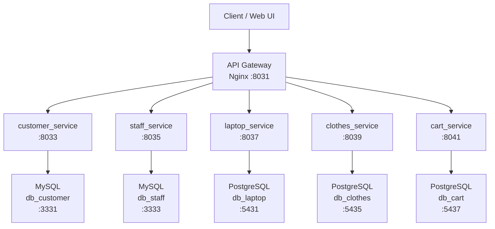

```mermaid
graph TB
    Client["Client / Web UI"]
    GW["API Gateway<br/>Nginx :8031"]
    CS["customer_service<br/>:8033"]
    SS["staff_service<br/>:8035"]
    LS["laptop_service<br/>:8037"]
    CLS["clothes_service<br/>:8039"]
    CA["cart_service<br/>:8041"]
    DBC["MySQL<br/>db_customer<br/>:3331"]
    DBS["MySQL<br/>db_staff<br/>:3333"]
    DBL["PostgreSQL<br/>db_laptop<br/>:5431"]
    DBCL["PostgreSQL<br/>db_clothes<br/>:5435"]
    DBCA["PostgreSQL<br/>db_cart<br/>:5437"]

    Client --> GW
    GW --> CS
    GW --> SS
    GW --> LS
    GW --> CLS
    GW --> CA
    CS --> DBC
    SS --> DBS
    LS --> DBL
    CLS --> DBCL
    CA --> DBCA
```
